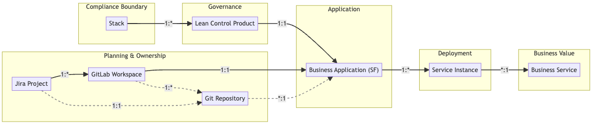

### Cardinality Table

| Source                   | Target               | Cardinality | Notes                                                     |
| ------------------------ | -------------------- | ----------- | --------------------------------------------------------- |
| **Stack**                | Lean Control Product | 1 : \*      | A Compliance Boundary contains multiple LCPs              |
| **Lean Control Product** | Business Application | 1 : 1       | One LCP governs one Business Application                  |
| **GitLab Workspace**     | Git Repository       | 1 : \*      | One workspace contains many repos (not explicitly mapped) |
| **GitLab Workspace**     | Business Application | 1 : 1       | One workspace maps to one Business App                    |
| **Jira Project**         | GitLab Workspace     | 1 : \*      | One Jira project governs many workspaces                  |
| **Business Application** | Service Instance     | 1 : \*      | A Business App has many deployment instances              |
| **Service Instance**     | Business Service     | \* : 1      | Many instances support a single business service          |
| **Git Repository**       | Business Application | \* : 1      | Many repos may relate to one BA (inferred only)           |
| **Jira Project**         | Git Repository       | 1 : 1       | One-to-one mapping is inferred but not explicitly tracked |

---

> **Note:**
> - **Dotted lines** in the diagram represent **implied relationships** — connections that are **not explicitly encoded** or enforced in the current system but are **logically inferred** (e.g., by naming, structure, or operational behavior).
> - **Open Question:** Should these implied relationships be **formally encoded and tracked** in the data model?

